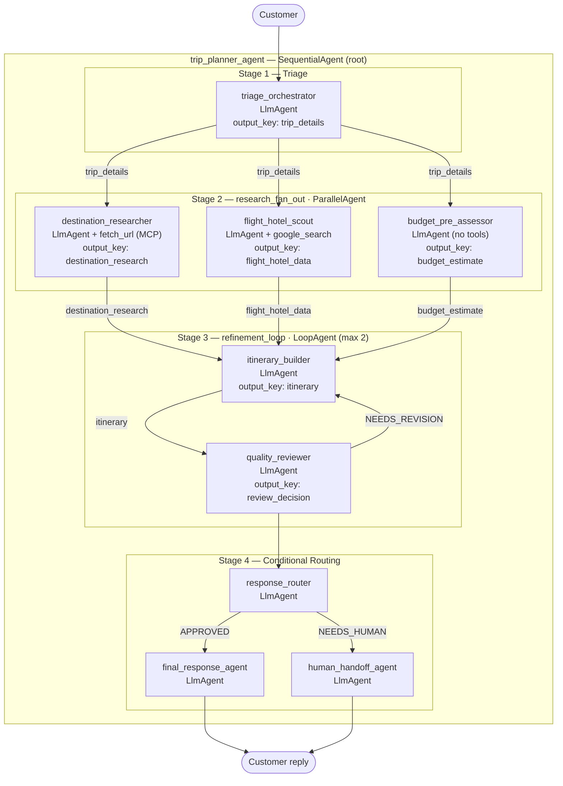

# Trip Planner Agent — Architecture Diagram

## Session State Bus

| Key                  | Written by               | Read by                                               |
|----------------------|--------------------------|-------------------------------------------------------|
| `trip_details`       | triage_orchestrator      | destination_researcher, flight_hotel_scout, budget_pre_assessor, itinerary_builder, quality_reviewer, response_router, final_response_agent, human_handoff_agent |
| `destination_research` | destination_researcher | itinerary_builder                                    |
| `flight_hotel_data`  | flight_hotel_scout       | itinerary_builder, final_response_agent              |
| `budget_estimate`    | budget_pre_assessor      | itinerary_builder, final_response_agent              |
| `itinerary`          | itinerary_builder        | quality_reviewer, itinerary_builder (self on loop), response_router, final_response_agent |
| `review_decision`    | quality_reviewer         | itinerary_builder, response_router, final_response_agent, human_handoff_agent |
